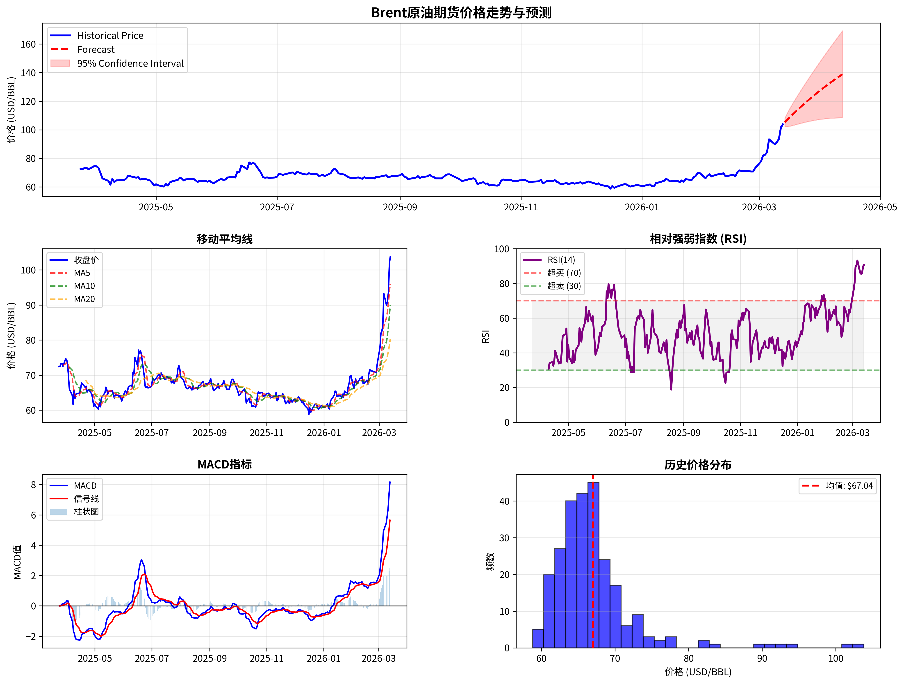

# 外盘期货走势展示与预测系统

## 项目简介

本系统基于 Python 实现，通过 akshare 获取真实的外盘原油期货行情数据，结合技术指标分析和 ARIMA 时间序列模型，对 WTI 和 Brent 原油期货进行走势展示与价格预测。

- 数据来源：akshare（免费，无需注册 API Key）
- 预测模型：ARIMA(1,1,1) 时间序列模型
- 分析品种：WTI 原油（NYMEX）、Brent 原油（ICE）

---

## 文件说明

```
futures_complete.py    主程序，包含所有功能逻辑
requirements.txt       Python 依赖包列表
README.md              本说明文件
```

运行后会在当前目录生成：
```
WTI_analysis.png       WTI 原油综合分析图表
Brent_analysis.png     Brent 原油综合分析图表
```

### 1. 运行程序

```bash
python futures_complete.py
```

---

## 功能说明

### 1. 真实数据获取

通过 akshare 拉取近 252 个交易日（约一年）的历史行情数据：

| 品种 | 交易所 | akshare 符号 |
|------|--------|-------------|
| WTI 原油 | NYMEX | CL |
| Brent 原油 | ICE | OIL |

每条数据包含：开盘价、最高价、最低价、收盘价、成交量。

### 2. 主力合约信息展示

控制台输出每个品种的详细合约信息：

- 交易所、合约乘数（100 USD/点）、最小变动单位、计价单位
- 最新价、开盘价、最高价、最低价、涨跌幅
- 成交量及成交量变化
- 期限结构：数据周期、平均价格、价格区间、历史波动率

### 3. 技术指标分析

| 指标 | 参数 | 说明 |
|------|------|------|
| MA | 5 / 10 / 20 日 | 移动平均线，判断趋势方向 |
| RSI | 14 日 | 相对强弱指数，判断超买超卖（>70 超买，<30 超卖） |
| MACD | 12 / 26 / 9 | 趋势跟踪动量指标，MACD 线与信号线交叉为买卖信号 |
| Bollinger Bands | 20 日，2 倍标准差 | 价格波动区间，用于判断突破和回归 |

### 4. ARIMA 价格预测

使用 ARIMA(1,1,1) 模型对收盘价时间序列进行建模，预测未来 30 天价格走势：

- 输出预测均值、最高值、最低值
- 提供 95% 置信区间
- 输出模型 AIC 值（越小越好）
- 控制台打印前 10 天逐日预测结果

> 注意：ARIMA 预测基于历史数据的统计规律，不代表实际市场走势，仅供参考。

### 5. 可视化图表

每个品种生成一张包含 5 个子图的综合分析图（300 DPI）：

| 子图 | 内容 |
|------|------|
| 图1（顶部通栏） | 历史价格走势 + ARIMA 预测 + 95% 置信区间 |
| 图2（左中） | 移动平均线（MA5 / MA10 / MA20）与收盘价 |
| 图3（右中） | RSI 指标，含超买（70）和超卖（30）参考线 |
| 图4（左下） | MACD 指标（MACD 线、信号线、柱状图） |
| 图5（右下） | 历史收盘价频率分布直方图，含均值标注 |


---

## 输出示例

### 控制台输出

```
======================================================================
Fetching real futures data via akshare...
======================================================================

[WTI Crude Oil (CL)]
✓ WTI data fetched: 252 rows, latest: $97.20

[Brent Crude Oil (OIL)]
✓ Brent data fetched: 252 rows, latest: $103.83

【WTI原油】
  最新价格: $97.20
  涨跌:     +2.10 (+2.21%)
  MA5:      $89.84  RSI(14): 83.95

【未来30天预测】
  预测均值: $110.92
  第1天: $98.22 (置信区间: $94.91 - $101.54)
  ...
```

---

## 代码结构

```python
class FuturesAnalyzer:
    get_sample_data()        # 通过 akshare 获取真实行情数据
    calculate_indicators()   # 计算 MA / RSI / MACD / 布林带
    display_contract_info()  # 输出合约详情和技术指标
    forecast_arima()         # ARIMA(1,1,1) 建模与预测
    plot_analysis()          # 生成 5 子图综合分析图表
    generate_report()        # 输出预测报告

def main():                  # 按顺序调用以上方法
```

---

## 依赖包

| 包名 | 版本要求 | 用途 |
|------|----------|------|
| akshare | >=1.14.0 | 获取真实期货行情数据 |
| pandas | >=1.3.0 | 数据处理 |
| numpy | >=1.21.0 | 数值计算 |
| matplotlib | >=3.4.0 | 图表绘制 |
| statsmodels | >=0.13.0 | ARIMA 模型 |
| scikit-learn | >=1.0.0 | 辅助计算 |


---


